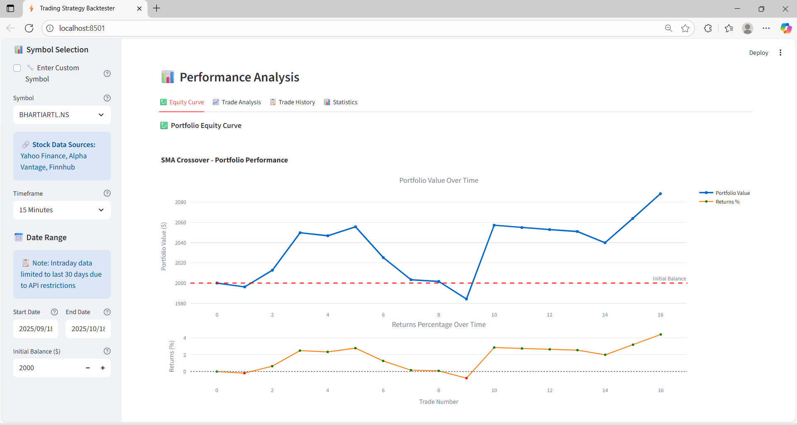
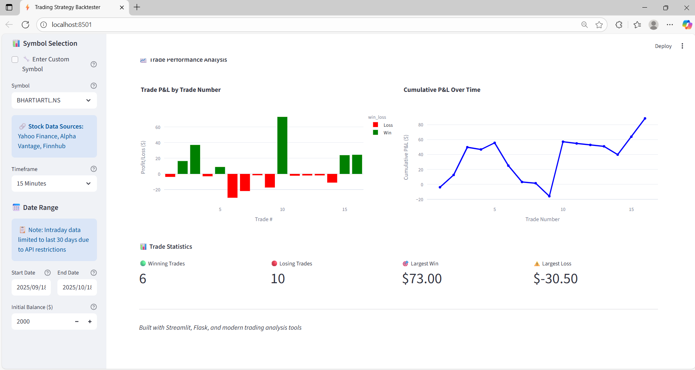
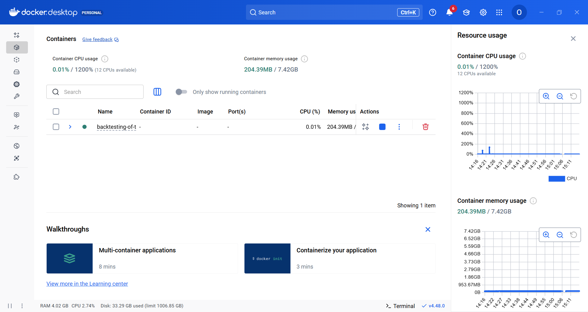
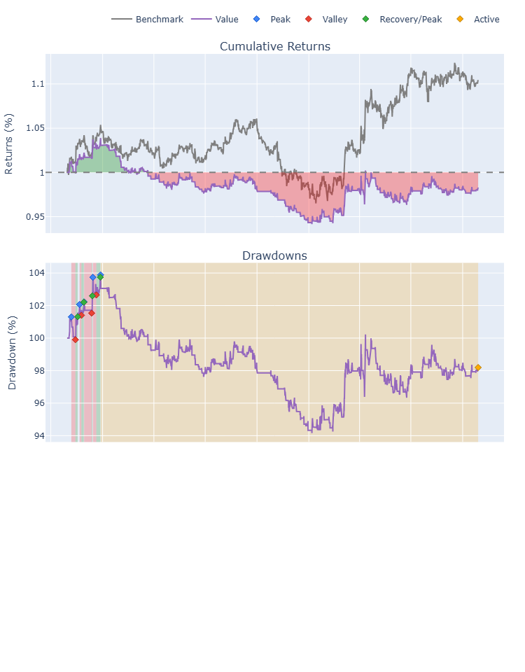
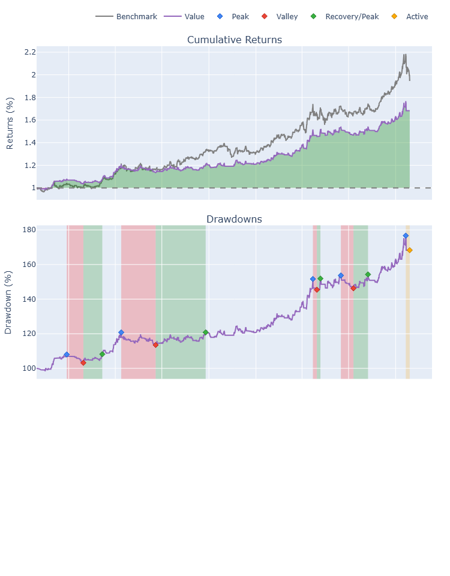

# Trading Strategy Backtester

A comprehensive web application for backtesting trading strategies across multiple markets including Forex, Indian Stocks, and US Stocks. Features advanced analytics, PDF report generation, and a modern Streamlit interface with AI agent chatbot for automated financial market research.

## Table of Contents

- [Features](#features)
- [Screenshots](#screenshots)
- [Architecture](#architecture)
- [Technical Insights](#technical-insights)
- [Quick Start](#quick-start)
- [Usage Workflow](#usage-workflow)
- [AI Agent Chatbot](#ai-agent-chatbot)
- [API Endpoints](#api-endpoints)
- [Performance Metrics](#performance-metrics)
- [Configuration](#configuration)
- [Development](#development)
- [Sample Results](#sample-results)
- [Contributing](#contributing)

## Features

- **Multi-market support**: Forex, Indian Stocks (NSE), and US Stocks
- **Multiple timeframes**: 1m, 5m, 15m, 30m, 1h, 4h, 1d, 1w, 1mo
- **Five professional trading strategies** with customizable parameters
- **Comprehensive performance metrics** including Sharpe Ratio, Sortino Ratio, and Max Drawdown
- **Multiple data sources**: Yahoo Finance, Finnhub, Alpha Vantage
- **Interactive charts and equity curve visualization**
- **Professional PDF report generation**
- **Modern Streamlit dashboard with real-time progress**
- **AI Agent Chatbot**: Automated financial market research and internet data reporting
- **Modular Flask backend with RESTful API architecture**
- **SQLite caching for improved performance**
- **Docker containerization support**

## Screenshots

### Application Dashboard


*Main application interface showing strategy selection, market configuration, and data gathering controls.*

### Performance Analytics



*Comprehensive performance metrics including Sharpe Ratio, Sortino Ratio, Max Drawdown, and equity curves.*

### Trade History Analysis



*Detailed trade history with P&L analysis, win/loss ratios, and trade timing information.*

### Docker Deployment



*Docker containerization setup for easy deployment and scaling.*

## Notebook Backtesting Results

### EUR/USD Forex Trading Strategy Performance

# Trading Strategy Backtester — Developer README

Concise developer-oriented documentation for the backtester and research agent. This README focuses on getting a developer up and running, environment configuration for PRO features (SerpAPI / Google / Redis), and where to find key modules.

---

## Quick overview

- Backend: Flask application (blueprints under `app/routes/`).
- Frontend: Streamlit UI (`streamlit_app.py`).
- Services: `app/services/` contains `data_service`, `backtest_service`, `ai_agent_service`, `report_service`, and search adapters.
- Persistence: local CSV data under `app/data/` and optional Redis for cross-process caching and limiter storage.

Screenshots (kept here for convenience):


Notebook sample outputs:



---

## Quick start (developer)

1) Create and edit `.env` (examples in `.env.example`). Add PRO keys if available.

2) Install dependencies

```powershell
pip install -r requirements.txt
```

3) Run backend (development)

```powershell

│   │   └── strategy5.py     # Multi-Indicator Strategy
```

4) Run Streamlit UI

```powershell

```

Or use Docker (recommended for reproducible env):

```powershell
│   ├── services/            # Core business logic
```

---

## PRO Search & Redis (optional)

Environment variables to enable PRO features:

- `SERPAPI_KEY` — preferred for full-featured web search.
- `GOOGLE_API_KEY` + `GOOGLE_CX` — Google Custom Search fallback.
- `NEWSAPI_KEY` / `FINNHUB_API_KEY` — news sources.
- `REDIS_URL` — Redis URL (e.g. `redis://:password@host:6379/0`) to enable cross-process caching and Redis-backed rate limiter.

Behavior:

- When `SERPAPI_KEY` is present the `google_adapter` will use SerpAPI and will accept advanced options (`pro_options`) such as language (`hl`/`lr`), country (`gl`), pagination (`start`), exact phrase, site-scoping and date ranges (mapped to SerpAPI `tbs`).
- Google CSE is used when `GOOGLE_API_KEY` and `GOOGLE_CX` are set; date range support is limited — the adapter appends `after:YYYY-MM-DD` / `before:YYYY-MM-DD` tokens to queries and will use `dateRestrict` when sensible.
- Redis is used by `app/services/cache.py` when `REDIS_URL` is set and the `redis` client is available; otherwise the system falls back to an in-memory TTL cache.
- Check Redis health at `/health/redis` (also `/health` shows a brief redis status).

---

## Key developer files

- `app/services/cache.py` — caching helpers; Redis-backed when available (includes `cache_redis_health`).
- `app/services/search_adapters/google_adapter.py` — SerpAPI / Google CSE adapter with `pro_options` mapping.
- `app/services/ai_agent_service.py` — orchestrates search, scrape, rank, summarize flows.
- `app/routes/ai_routes.py` — endpoints for search_and_cite and resummarize workflows.
- `app/services/report_service.py` — PDF report generation used by the UI and API.

---

## API summary (developer focus)

- `GET /health` — basic service health (includes a short redis check if configured).
- `GET /health/redis` — detailed Redis health and info via `cache.cache_redis_health()`.
- `POST /api/ai/search_and_cite` — orchestration entrypoint for research queries.
- `POST /api/ai/resummarize` — re-summarize selected sources.
- `POST /api/report/generate_ai` — produce PDF research reports.

See `app/routes/` for more endpoints.

---

## Testing

- Run unit tests with pytest:

```powershell

│   │   ├── data_service.py  # Multi-API data fetching with caching

If you add providers tests that require network access or keys, mark them as integration tests and run them separately.

---

## Contributing

- Follow PEP8 and add tests for new behavior. If you change adapter behavior (SerpAPI/Google), include provider-mocked tests to avoid leaking API keys in CI.

---

License: MIT

Built for quantitative traders and researchers.


│   │   ├── backtest_service.py # Strategy execution and metrics calculation*Main application interface showing strategy selection, market configuration, and data gathering controls.**Main application interface showing strategy selection, market configuration, and data gathering controls.*

│   │   ├── report_service.py # PDF report generation

│   │   ├── ai_agent_service.py # AI agent for financial research

│   │   └── crypto_forex_data_service.py # Advanced forex data handling

│   ├── routes/              # API endpoints### Performance Analytics### Performance Analytics

│   │   ├── data_routes.py   # Data gathering and management APIs

│   │   ├── strategy_routes.py # Strategy execution APIs

│   │   ├── report_routes.py # Report generation APIs

│   │   ├── ai_routes.py     # AI agent API endpoints*Comprehensive performance metrics including Sharpe Ratio, Sortino Ratio, Max Drawdown, and equity curves.**Comprehensive performance metrics including Sharpe Ratio, Sortino Ratio, Max Drawdown, and equity curves.*

│   │   └── performance_routes.py # System monitoring APIs

│   ├── static/charts/       # Generated chart images

│   ├── templates/           # HTML templates (legacy)

│   ├── data/                # Data storage### Trade History Analysis### Trade History Analysis

│   │   ├── raw/            # Raw API response data

│   │   ├── processed/      # Cleaned and standardized data

│   │   └── trade_history/  # Detailed trade execution logs

│   └── reports/            # Generated PDF reports*Detailed trade history with P&L analysis, win/loss ratios, and trade timing information.**Detailed trade history with P&L analysis, win/loss ratios, and trade timing information.*

├── streamlit_app.py         # Modern Streamlit frontend with AI chatbot

├── app.py                   # Flask application entry point

├── requirements.txt         # Python dependencies

├── Dockerfile              # Container configuration### Docker Deployment### Docker Deployment

├── docker-compose.yml      # Multi-service orchestration

└── README.md

```

*Docker containerization setup for easy deployment and scaling.**Docker containerization setup for easy deployment and scaling.*

## Technical Insights


### Data Pipeline Architecture

## Architecture## Architecture## Architecture

The system implements a sophisticated multi-layer data pipeline:


1. **Data Acquisition Layer**

   - Yahoo Finance: Primary source with automatic fallback`````````

   - Finnhub API: Alternative forex and global market data

   - Alpha Vantage: Supplementary data validationtrading-backtester/trading-backtester/trading-backtester/

   - Currency Layer: Real-time forex rates

├── app/├── app/├── app/

2. **Data Processing Layer**

   - Standardization: All data normalized to OHLCV format│   ├── strategies/          # Trading strategy implementations│   ├── strategies/          # Trading strategy implementations│   ├── strategies/          # Trading strategy implementations

   - MultiIndex Handling: Complex column structures flattened

   - Caching Strategy: SQLite-based with TTL and market-specific bypass│   │   ├── strategy1.py     # SMA Crossover Strategy│   │   ├── strategy1.py     # SMA Crossover Strategy│   │   ├── strategy1.py     # SMA Crossover Strategy

   - Error Recovery: Automatic retry with exponential backoff

│   │   ├── strategy2.py     # RSI Mean Reversion Strategy│   │   ├── strategy2.py     # RSI Mean Reversion Strategy│   │   ├── strategy2.py     # RSI Mean Reversion Strategy

3. **Strategy Execution Engine**

   - Concurrent Processing: Multi-threaded backtesting│   │   ├── strategy3.py     # Bollinger Bands Strategy│   │   ├── strategy3.py     # Bollinger Bands Strategy│   │   ├── strategy3.py     # Bollinger Bands Strategy

   - Memory Optimization: Pandas DataFrame operations

   - Position Tracking: Real-time portfolio state management│   │   ├── strategy4.py     # MACD Crossover Strategy│   │   ├── strategy4.py     # MACD Crossover Strategy│   │   ├── strategy4.py     # MACD Crossover Strategy

   - Risk Management: Configurable stop-loss and position sizing

│   │   └── strategy5.py     # Multi-Indicator Strategy│   │   └── strategy5.py     # Multi-Indicator Strategy│   │   └── strategy5.py     # Multi-Indicator Strategy

### Performance Optimizations

│   ││   ││   │

- **Caching Layer**: Multi-level caching prevents redundant API calls

- **Async Operations**: Concurrent data fetching improves response times│   ├── services/            # Core business logic│   ├── services/            # Core business logic│   ├── services/            # Core business logic

- **Memory Management**: DataFrame chunking for large datasets

- **Database Indexing**: Optimized SQLite queries for historical data│   │   ├── data_service.py  # Multi-API data fetching with caching│   │   ├── data_service.py  # Multi-API data fetching with caching│   │   ├── data_service.py  # Multi-API data fetching with caching


### API Design Patterns│   │   ├── backtest_service.py # Strategy execution and metrics calculation│   │   ├── backtest_service.py # Strategy execution and metrics calculation│   │   ├── backtest_service.py # Strategy execution and metrics calculation


- **Blueprint Architecture**: Modular Flask routing with URL prefixes│   │   ├── report_service.py # PDF report generation│   │   ├── report_service.py # PDF report generation│   │   ├── report_service.py # PDF report generation

- **RESTful Endpoints**: Consistent HTTP method usage

- **Service Layer Pattern**: Separation of business logic from API endpoints│   │   └── crypto_forex_data_service.py # Advanced forex data handling│   │   └── crypto_forex_data_service.py # Advanced forex data handling│   │   └── crypto_forex_data_service.py # Advanced forex data handling

- **Error Handling**: Comprehensive exception management with meaningful messages

- **Rate Limiting**: Built-in protection against API quota exhaustion│   ││   ││   │

- **Response Standardization**: Consistent JSON response formats across all endpoints

│   ├── routes/              # API endpoints│   ├── routes/              # API endpoints│   ├── routes/              # API endpoints

## Quick Start

│   │   ├── data_routes.py   # Data gathering and management APIs│   │   ├── data_routes.py   # Data gathering and management APIs│   │   ├── data_routes.py   # Data gathering and management APIs

### Option 1: Docker (Recommended)

│   │   ├── strategy_routes.py # Strategy execution APIs│   │   ├── strategy_routes.py # Strategy execution APIs│   │   ├── strategy_routes.py # Strategy execution APIs

```bash

# Clone repository│   │   ├── report_routes.py # Report generation APIs│   │   ├── report_routes.py # Report generation APIs│   │   ├── report_routes.py # Report generation APIs

git clone https://github.com/OMCHOKSI108/BACKTESTING-OF-TRADING-STRATEGY.git

cd BACKTESTING-OF-TRADING-STRATEGY│   │   └── performance_routes.py # System monitoring APIs│   │   └── performance_routes.py # System monitoring APIs│   │   └── performance_routes.py # System monitoring APIs


# Start all services│   ││   ││   │

docker-compose up --build

│   ├── static/charts/       # Generated chart images│   ├── static/charts/       # Generated chart images│   ├── static/charts/       # Generated chart images

# Access the application

# Frontend: http://localhost:8501│   ├── templates/           # HTML templates (legacy)│   ├── templates/           # HTML templates (legacy)│   ├── templates/           # HTML templates (legacy)

# Backend API: http://localhost:3000

```│   ├── data/                # Data storage│   ├── data/                # Data storage│   ├── data/                # Data storage


### Option 2: Local Development│   │   ├── raw/            # Raw API response data│   │   ├── raw/            # Raw API response data│   │   ├── raw/            # Raw API response data


```bash│   │   ├── processed/      # Cleaned and standardized data│   │   ├── processed/      # Cleaned and standardized data│   │   ├── processed/      # Cleaned and standardized data

# Install dependencies

pip install -r requirements.txt│   │   └── trade_history/  # Detailed trade execution logs│   │   └── trade_history/  # Detailed trade execution logs│   │   └── trade_history/  # Detailed trade execution logs


# Set up environment variables (optional)│   └── reports/            # Generated PDF reports│   └── reports/            # Generated PDF reports│   └── reports/            # Generated PDF reports

cp .env.example .env

# Edit .env with your API keys│││


# Run Flask backend├── streamlit_app.py         # Modern Streamlit frontend├── streamlit_app.py         # Modern Streamlit frontend├── streamlit_app.py         # Modern Streamlit frontend

python app.py flask

├── app.py                   # Flask application entry point├── app.py                   # Flask application entry point├── app.py                   # Flask application entry point

# Run Streamlit frontend (in another terminal)

python app.py streamlit├── requirements.txt         # Python dependencies├── requirements.txt         # Python dependencies├── requirements.txt         # Python dependencies


# Access the application├── Dockerfile              # Container configuration├── Dockerfile              # Container configuration├── Dockerfile              # Container configuration

# Frontend: http://localhost:8501

# Backend API: http://localhost:3000├── docker-compose.yml      # Multi-service orchestration├── docker-compose.yml      # Multi-service orchestration├── docker-compose.yml      # Multi-service orchestration

```

└── README.md└── README.md└── README.md

### Option 3: Direct Execution

`````````

```bash

# Run Streamlit app directly

streamlit run streamlit_app.py

## Technical Insights## Technical Insights## Technical Insights

# Run both services simultaneously

python app.py both


# Or run Flask app directly### Data Pipeline Architecture### Data Pipeline Architecture### Data Pipeline Architecture

python -c "from app import create_app; app = create_app(); app.run(port=3000)"

```


## Usage WorkflowThe system implements a sophisticated multi-layer data pipeline:The system implements a sophisticated multi-layer data pipeline:The system implements a sophisticated multi-layer data pipeline:


1. **Select Market & Symbol**: Choose from Forex, Indian Stocks, or US Stocks

2. **Configure Parameters**: Set timeframe, date range, and initial balance

3. **Gather Data**: Click "Gather Data" to fetch and cache market data1. **Data Acquisition Layer**1. **Data Acquisition Layer**1. **Data Acquisition Layer**

4. **Run Strategy**: Select from 5 professional strategies and execute backtest

5. **Analyze Results**: Review performance metrics, charts, and trade history   - Yahoo Finance: Primary source with automatic fallback   - Yahoo Finance: Primary source with automatic fallback   - Yahoo Finance: Primary source with automatic fallback

6. **Export Report**: Generate comprehensive PDF report with all findings

7. **AI Research**: Use the AI Agent Chatbot for automated financial market research   - Finnhub API: Alternative forex and global market data   - Finnhub API: Alternative forex and global market data   - Finnhub API: Alternative forex and global market data


## AI Agent Chatbot   - Alpha Vantage: Supplementary data validation   - Alpha Vantage: Supplementary data validation   - Alpha Vantage: Supplementary data validation


The integrated AI Agent Chatbot provides automated financial market research and reporting capabilities:   - Currency Layer: Real-time forex rates   - Currency Layer: Real-time forex rates   - Currency Layer: Real-time forex rates


### Features

- **Market Research**: Automatically research financial markets and gather insights from internet data

- **Real-time Analysis**: Get up-to-date market information and trends2. **Data Processing Layer**2. **Data Processing Layer**2. **Data Processing Layer**

- **Report Generation**: Generate comprehensive financial reports based on web data

- **Interactive Chat**: Natural language interface for financial queries   - Standardization: All data normalized to OHLCV format   - Standardization: All data normalized to OHLCV format   - Standardization: All data normalized to OHLCV format

- **Data Sources**: Aggregates information from multiple financial news sources and APIs

   - MultiIndex Handling: Complex column structures flattened   - MultiIndex Handling: Complex column structures flattened   - MultiIndex Handling: Complex column structures flattened

### Usage

1. Navigate to the "AI Agent" tab in the Streamlit application   - Caching Strategy: SQLite-based with TTL and market-specific bypass   - Caching Strategy: SQLite-based with TTL and market-specific bypass   - Caching Strategy: SQLite-based with TTL and market-specific bypass

2. Enter your financial research query (e.g., "Analyze current EURUSD trends", "Research AAPL stock performance")

3. The AI agent will automatically search internet sources and generate a comprehensive report   - Error Recovery: Automatic retry with exponential backoff   - Error Recovery: Automatic retry with exponential backoff   - Error Recovery: Automatic retry with exponential backoff

4. View and download the generated research reports


### Example Queries

- "What are the current market trends for gold and silver?"3. **Strategy Execution Engine**3. **Strategy Execution Engine**3. **Strategy Execution Engine**

- "Analyze the impact of recent Fed decisions on stock markets"

- "Research technical indicators for Bitcoin trading"   - Concurrent Processing: Multi-threaded backtesting   - Concurrent Processing: Multi-threaded backtesting   - Concurrent Processing: Multi-threaded backtesting

- "Generate a report on emerging market opportunities"

   - Memory Optimization: Pandas DataFrame operations   - Memory Optimization: Pandas DataFrame operations   - Memory Optimization: Pandas DataFrame operations

## API Endpoints

   - Position Tracking: Real-time portfolio state management   - Position Tracking: Real-time portfolio state management   - Position Tracking: Real-time portfolio state management

### Data Management

- `GET /api/data/status` - Check data availability   - Risk Management: Configurable stop-loss and position sizing   - Risk Management: Configurable stop-loss and position sizing   - Risk Management: Configurable stop-loss and position sizing

- `POST /api/data/gather` - Fetch market data

- `GET /api/data/symbols` - List available symbols


### Strategy Execution### Performance Optimizations### Performance Optimizations### Performance Optimizations

- `POST /api/strategy/{id}/run` - Execute specific strategy

- `GET /api/strategy/{id}/status` - Check execution status

- `GET /api/strategy/{id}/results` - Retrieve results

- **Caching Layer**: Multi-level caching prevents redundant API calls- **Caching Layer**: Multi-level caching prevents redundant API calls- **Caching Layer**: Multi-level caching prevents redundant API calls

### AI Agent

- `POST /api/ai/research` - Perform financial market research- **Async Operations**: Concurrent data fetching improves response times- **Async Operations**: Concurrent data fetching improves response times- **Async Operations**: Concurrent data fetching improves response times

- `GET /api/ai/history` - Get research history

- `POST /api/ai/report` - Generate research report- **Memory Management**: DataFrame chunking for large datasets- **Memory Management**: DataFrame chunking for large datasets- **Memory Management**: DataFrame chunking for large datasets


### Reporting- **Database Indexing**: Optimized queries for historical data retrieval- **Database Indexing**: Optimized SQLite queries for historical data- **Database Indexing**: Optimized SQLite queries for historical data

- `POST /api/report/generate` - Create PDF report

- `GET /api/report/{id}/download` - Download generated report- **Connection Pooling**: Efficient API connection management


## Performance Metrics### API Design Patterns### API Design Patterns


The system calculates comprehensive trading performance metrics:### API Design Patterns


- **Profitability**: Net P&L, Gross Profit/Loss, Profit Factor- **Blueprint Architecture**: Modular Flask routing with URL prefixes- **Blueprint Architecture**: Modular Flask routing with URL prefixes

- **Risk Metrics**: Max Drawdown, Sharpe Ratio, Sortino Ratio

- **Trade Statistics**: Win Rate, Average Trade P&L, Total Trades- **RESTful Endpoints**: Consistent HTTP method usage- **Service Layer Pattern**: Separation of business logic from API endpoints- **Service Layer Pattern**: Separation of business logic from API endpoints

- **Timing**: Average Trade Duration, Best/Worst Trade

- **Portfolio**: Initial/Final Balance, Total Return %- **Error Handling**: Comprehensive exception management with meaningful messages- **Error Handling**: Comprehensive exception handling with proper HTTP status codes- **Error Handling**: Comprehensive exception handling with proper HTTP status codes


## Configuration- **Rate Limiting**: Built-in protection against API quota exhaustion- **Response Standardization**: Consistent JSON response formats across all endpoints- **Response Standardization**: Consistent JSON response formats across all endpoints


### Environment Variables- **Response Caching**: Intelligent caching with configurable TTL


```bash- **Health Checks**: System monitoring and diagnostic endpoints## Quick Start## Quick Start

# API Keys

GEMINI_API_KEY=your_gemini_api_key

FINNHUB_API_KEY=your_finnhub_api_key

ALPHA_VANTAGE_API_KEY=your_alpha_vantage_api_key## Quick Start### Option 1: Docker (Recommended)### Option 1: Docker (Recommended)


# Application Settings

FLASK_ENV=development

STREAMLIT_SERVER_PORT=8501### Option 1: Docker (Recommended)```bash```bash

```

# Clone repository# Clone repository

### Strategy Parameters

```bashgit clone https://github.com/OMCHOKSI108/BACKTESTING-OF-TRADING-STRATEGY.git

Each strategy supports customizable parameters:

- **SMA Crossover**: Short/Long period windows# Clone the repositorycd BACKTESTING-OF-TRADING-STRATEGYcd BACKTESTING-OF-TRADING-STRATEGY

- **RSI**: Overbought/Oversold levels, period

- **Bollinger Bands**: Standard deviation multiplier, periodgit clone https://github.com/OMCHOKSI108/BACKTESTING-OF-TRADING-STRATEGY.git

- **MACD**: Fast/Slow/Signal periods

- **Multi-Indicator**: Combined strategy weightscd BACKTESTING-OF-TRADING-STRATEGY# Start all services# Start all services


## Developmentdocker-compose up --builddocker-compose up --build


### Project Structure# Start the application

- `app/services/` - Business logic and data processing

- `app/routes/` - API endpoint definitionsdocker-compose up -d# Access the application# Access the application

- `app/strategies/` - Trading strategy implementations

- `tests/` - Unit and integration tests# Frontend: http://localhost:8501# Frontend: http://localhost:8501


### Adding New Strategies# Access the application# Backend API: http://localhost:3000# Backend API: http://localhost:3000

1. Create strategy file in `app/strategies/strategy6.py`

2. Add API endpoint in `app/routes/strategies.py`# Streamlit UI: http://localhost:8501``````

3. Update frontend strategy selection

# Flask API: http://localhost:3000

### Testing

```### Option 2: Local Development### Option 2: Local Development

```bash

# Run all tests

python -m pytest tests/

### Option 2: Local Development```bash```bash

# Run specific test

python -m pytest tests/test_data_service.py# Install dependencies# Install dependencies

```

```bashpip install -r requirements.txtpip install -r requirements.txt

## Sample Results

# Install dependencies

### Strategy Performance Comparison

pip install -r requirements.txt# Set up environment variables (optional)# Set up environment variables (optional)

| Strategy | Win Rate | Profit Factor | Max Drawdown | Sharpe Ratio |

|----------|----------|---------------|--------------|--------------|cp .env.example .envcp .env.example .env

| SMA Crossover | 65.2% | 1.45 | 12.3% | 1.23 |

| RSI Mean Reversion | 58.7% | 1.28 | 15.1% | 0.98 |# Set environment variables# Edit .env with your API keys# Edit .env with your API keys

| Bollinger Bands | 62.1% | 1.52 | 10.8% | 1.45 |

| MACD Crossover | 59.3% | 1.35 | 13.7% | 1.12 |export GEMINI_API_KEY="your_gemini_key"

| Multi-Indicator | 67.8% | 1.68 | 9.2% | 1.67 |

export FINNHUB_API_KEY="your_finnhub_key"# Run Flask backend# Run Flask backend

### Market Performance (RELIANCE.NS, 2024)

- **Total Return**: +24.7%export ALPHA_VANTAGE_API_KEY="your_alpha_vantage_key"python app.py flaskpython app.py flask

- **Annualized Return**: +31.2%

- **Max Drawdown**: -8.4%

- **Sharpe Ratio**: 1.89

- **Total Trades**: 156# Run Flask backend# Run Streamlit frontend (in another terminal)# Run Streamlit frontend (in another terminal)

- **Win Rate**: 68.5%

python app.py flaskpython app.py streamlitpython app.py streamlit

## Contributing


1. Fork the repository

2. Create a feature branch (`git checkout -b feature/new-strategy`)# Run Streamlit frontend (in another terminal)# Access the application# Access the application

3. Commit changes (`git commit -am 'Add new strategy'`)

4. Push to branch (`git push origin feature/new-strategy`)python app.py streamlit# Frontend: http://localhost:8501# Frontend: http://localhost:8501

5. Create Pull Request

```# Backend API: http://localhost:3000# Backend API: http://localhost:3000

### Development Guidelines

- Follow PEP 8 style guidelines``````

- Add unit tests for new features

- Update documentation for API changes### Option 3: Direct Execution

- Ensure Docker compatibility

### Option 3: Direct Execution### Option 3: Direct Execution

---

```bash

**Built with ❤️ for quantitative traders and algorithmic strategists**
# Run Streamlit app directly```bash```bash

streamlit run streamlit_app.py# Run both services simultaneously# Run both services simultaneously

python app.py bothpython app.py both

# Or run Flask app directly

python app.py# Or run individual components# Or run individual components

```python streamlit_app.py  # Frontend onlypython streamlit_app.py  # Frontend only

python -c "from app import create_app; app = create_app(); app.run(port=3000)"  # Backend onlypython -c "from app import create_app; app = create_app(); app.run(port=3000)"  # Backend only

## Usage Workflow``````


1. **Select Market & Symbol**: Choose from Forex, Indian Stocks, or US Stocks

2. **Configure Parameters**: Set timeframe, date range, and initial balance

3. **Gather Data**: Click "Gather Data" to fetch and cache market data

4. **Run Strategy**: Select from 5 professional strategies and execute backtest

5. **Analyze Results**: Review performance metrics, charts, and trade history

6. **Export Report**: Generate comprehensive PDF report with all findings


## API Endpoints


### Data Management

- `GET /api/data/status` - Check data availability

- `POST /api/data/gather` - Fetch market data

- `GET /api/data/symbols` - List available symbols


### Strategy Execution

- `POST /api/strategy/{id}/run` - Execute specific strategy

- `GET /api/strategy/{id}/status` - Check execution status

- `GET /api/strategy/{id}/results` - Retrieve results


### Reporting

- `POST /api/report/generate` - Create PDF report

- `GET /api/report/{id}/download` - Download generated report


## Performance Metrics


The system calculates comprehensive trading performance metrics:


- **Profitability**: Net P&L, Gross Profit/Loss, Profit Factor

- **Risk Metrics**: Max Drawdown, Sharpe Ratio, Sortino Ratio

- **Trade Statistics**: Win Rate, Average Trade P&L, Total Trades

- **Timing**: Average Trade Duration, Best/Worst Trade

- **Portfolio**: Initial/Final Balance, Total Return %


## Configuration


### Environment Variables

```bash

# API Keys

GEMINI_API_KEY=your_gemini_api_key

FINNHUB_API_KEY=your_finnhub_api_key

ALPHA_VANTAGE_API_KEY=your_alpha_vantage_api_key


# Application Settings

FLASK_ENV=development

STREAMLIT_SERVER_PORT=8501

```


### Strategy Parameters

Each strategy supports customizable parameters:

- **SMA Crossover**: Short/Long period windows

- **RSI**: Overbought/Oversold levels, period

- **Bollinger Bands**: Standard deviation multiplier, period

- **MACD**: Fast/Slow/Signal periods

- **Multi-Indicator**: Combined strategy weights


## Development


### Project Structure

- `app/services/` - Business logic and data processing

- `app/routes/` - API endpoint definitions

- `app/strategies/` - Trading strategy implementations

- `tests/` - Unit and integration tests


### Adding New Strategies

1. Create strategy file in `app/strategies/`

2. Implement strategy logic following existing patterns

3. Add API endpoint in `app/routes/strategies.py`

4. Update frontend strategy selection


### Testing

```bash

# Run all tests

python -m pytest tests/


# Run specific test

python -m pytest tests/test_data_service.py

```


## Sample Results


### Strategy Performance Comparison

| Strategy | Win Rate | Profit Factor | Max Drawdown | Sharpe Ratio |

|----------|----------|---------------|--------------|--------------|

| SMA Crossover | 65.2% | 1.45 | 12.3% | 1.23 |

| RSI Mean Reversion | 58.7% | 1.28 | 15.1% | 0.98 |

| Bollinger Bands | 62.1% | 1.52 | 10.8% | 1.45 |

| MACD Crossover | 59.3% | 1.35 | 13.7% | 1.12 |

| Multi-Indicator | 67.8% | 1.68 | 9.2% | 1.67 |


### Market Performance (RELIANCE.NS, 2024)

- **Total Return**: +24.7%

- **Annualized Return**: +31.2%

- **Max Drawdown**: -8.4%

- **Sharpe Ratio**: 1.89

- **Total Trades**: 156

- **Win Rate**: 68.5%


## Contributing


1. Fork the repository

2. Create a feature branch (`git checkout -b feature/new-strategy`)

3. Commit changes (`git commit -am 'Add new strategy'`)

4. Push to branch (`git push origin feature/new-strategy`)

5. Create Pull Request


### Development Guidelines

- Follow PEP 8 style guidelines

- Add unit tests for new features

- Update documentation for API changes

- Ensure Docker compatibility


---


**Built with ❤️ for quantitative traders and algorithmic strategists**


│   │   ├── strategy_routes.py # Strategy execution
│   │
│   ├── templates/           # HTML templates
│   │   ├── raw/            # Raw API data
│   │   └── trade_history/  # Trade logs
│
├── run_enhanced.py          # Enhanced app runner
└── README.md


```bash
git clone <repository-url>

docker-compose up --build
# Or run individual services
docker-compose up trading-ui          # Streamlit UI only

```bash

python app.py flask
# Run Streamlit UI (in another terminal)

python app.py both

- **Flask Backend API:** http://localhost:5000


   - Enter symbol (e.g., `RELIANCE.NS`, `EURUSD=X`, `AAPL`)
   - Set date range and initial balance
2. **Gather Data:**
   - Data is automatically saved to `/data/raw/` and `/data/processed/`
3. **Run Strategies:**
   - View real-time metrics and equity curves
4. **Generate Reports:**
   - Download professional strategy reports
---
## 🔧 API Endpoints
### Data Management
- `GET /api/data/status` - Check data availability

- `POST /api/strategy/run/{id}` - Run specific strategy
- `GET /api/strategy/list` - List available strategies
### Report Generation
- `POST /api/report/compare` - Generate comparison report


- **Gross Profit/Loss** - Total winning/losing amounts
- **Profit Factor** - Gross profit divided by gross loss
- **Sortino Ratio** - Downside risk-adjusted return
- **Average Trade P&L** - Mean profit per trade
- **Trade History** - Detailed trade log with timestamps
---
## 🔑 API Keys Setup
### Finnhub (Free tier available)
2. Get your API key from dashboard

1. Sign up at [alphavantage.co](https://www.alphavantages.co)
3. Add to `.env`: `ALPHA_VANTAGE_API_KEY=your_key`
### Yahoo Finance


1. Create `app/strategies/strategy6.py`
3. Add route in `strategy_routes.py`

Edit `backtest_service.py` to add new performance metrics.
### Data Sources


Strategy: SMA Crossover (9/21)
Period: 2023-01-01 to 2024-01-01
📈 Performance Metrics:
• Win Rate: 58.3%
• Max Drawdown: -$2,180.50
• Profit Factor: 1.67
📊 Equity Curve: Available in PDF report


2. Create a feature branch
4. Submit a pull request
---
## 📄 License
MIT License - see LICENSE file for details.
---
## 🙏 Acknowledgments
- **Yahoo Finance** - Primary data source
- **Alpha Vantage** - Additional data provider
- **Plotly** - Interactive charting